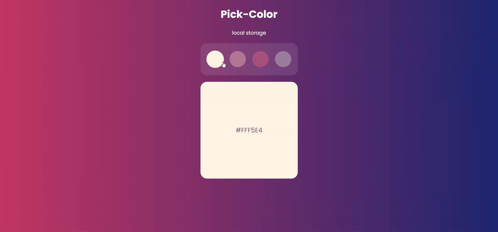

# pick-color-local-storage

### You can cheek out [HEAR](https://hassan-jaber.github.io/pick-color-local-storage/)

## This project has been developed depends on :
* Using a good page layout
* Using semantic HTML
* Responsive design
* Document Object Model - DOM
* Browser Object Model - BOM
* Local Storage

## Technical languages
  